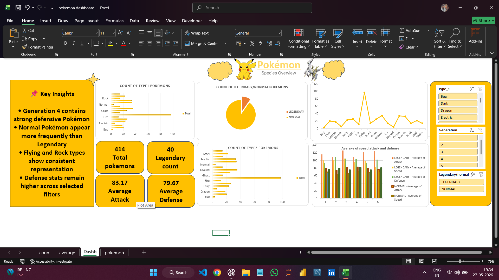

# 📊 Pokémon Excel Dashboard

An interactive Excel dashboard created using Pivot Tables, Charts, KPI Cards, and Slicers to analyze Pokémon statistics and performance trends.

---

# 🚀 Project Overview

This dashboard was developed to transform raw Pokémon dataset information into meaningful visual insights using Excel analytics techniques.

The project focuses on:
- Data Visualization
- Interactive Filtering
- KPI Reporting
- Trend Analysis
- Dashboard Designing

---

# 🛠️ Tools Used

- Microsoft Excel
- Pivot Tables
- Pivot Charts
- Slicers
- KPI Cards
- Data Cleaning

---

# ✨ Features

- 📊 Interactive Dashboard
- 🎛️ Dynamic Slicers
- 📈 KPI Cards
- 📉 Comparative Analysis
- 🎨 Pokémon Themed UI
- 📌 Insight Generation

---

# 📷 Dashboard Preview



---

# 📌 Key Insights

- Generation 4 contains strong defensive Pokémon
- Normal Pokémon appear more frequently than Legendary Pokémon
- Flying and Rock types show consistent representation
- Defense stats remain higher across selected filters

---

# 📂 Project Structure

```plaintext
pokemon-excel-dashboard/
│
├── README.md
├── pokemon_dashboard.xlsx
├── dashboard_preview.png
├── dataset/
│   └── pokemon_dataset.csv
```

---

# 💡 Skills Demonstrated

- Data Visualization
- Dashboard Design
- Excel Analytics
- Pivot Table Analysis
- Data Storytelling
- Interactive Reporting

---

# 👨‍💻 Author

## Aryan Prasad

- 💻 GitHub: https://github.com/thearyanprasad
- 🔗 LinkedIn: https://www.linkedin.com/in/prasadaryan9354
- 📸 Instagram: https://www.instagram.com/madmello_aryan

---

⭐ If you found this project interesting, consider giving it a star!
